<h1 align="center">Arcade</h1>

<p align="center">
<a href="https://mathworks.com/matlabcentral/fileexchange/"></a>&nbsp;&nbsp;
<a href="https://matlab.mathworks.com/"></a>&nbsp;&nbsp;
<a href="index.html"></a>
</p>

15 arcade games built entirely in MATLAB - 8 timeless classics and 7 originals. No toolboxes, no external dependencies, no imported assets. Every pixel is drawn using native MATLAB graphics.

Features a neon-styled launcher with an animated starfield menu, persistent high scores, frame-rate-independent physics, and automatic display scaling that ties everything together. Pick up and play with mouse, keyboard, or both.

<p align="center">
  
</p>

Built with [Claude](https://claude.ai) via the [MATLAB MCP Core Server](https://github.com/matlab/matlab-mcp-core-server).

Also available as a [browser port](index.html) - a single self-contained HTML5 Canvas file with all 15 games. Read more about the porting process [here](technical.html).

---

## Quick Start

```matlab
Arcade();
```

Or launch any game directly in standalone mode:

```matlab
games.Pong().play();
games.Tetris().play();
games.Asteroids().play();
```

---

## The Classics

8 legendary arcade games, recreated from scratch in pure MATLAB.

### 1. Pong

AI opponent that adapts as you score - its error shrinks and speed climbs with every point you land. Paddle-angle physics with rally escalation. The AI simulates the ball's path before choosing its target. First to 10 wins.

<p align="center">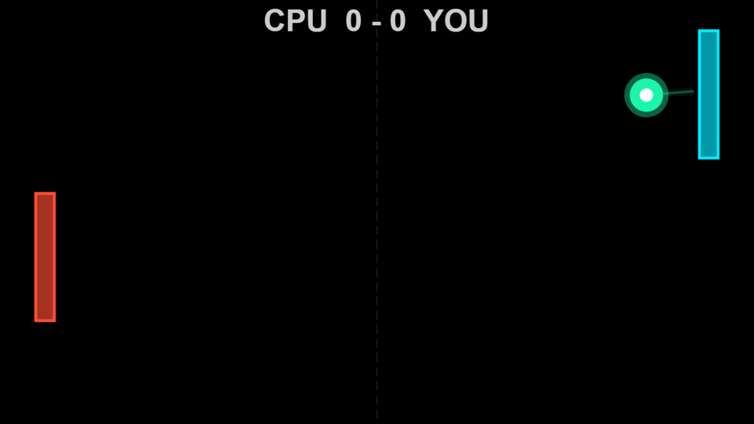</p>


### 2. Breakout

5 levels of escalating brick layouts - from single-hit rows to armored sandwiches with indestructible shield bricks. Power-ups drop on brick breaks: fireball (plows through everything), wide paddle, slow ball, multi-ball (up to 3 on screen), and extra life. Paddle angle controls the ricochet.

<p align="center">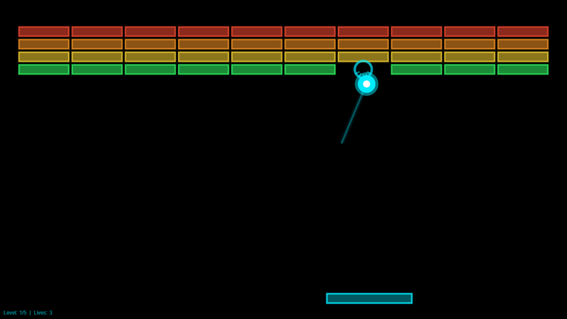</p>

### 3. Snake

Grid-based with wrap-around walls. Arrow keys or mouse-guided movement. Speed increases as you grow.

<p align="center">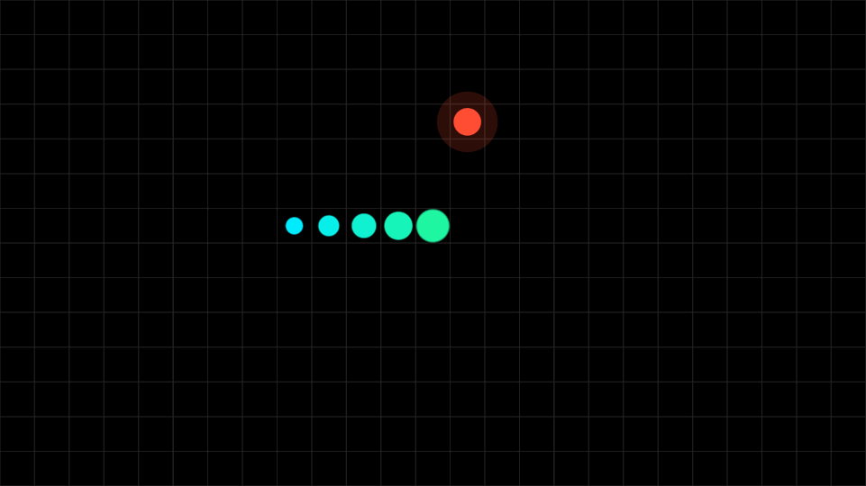</p>

### 4. Tetris

Full SRS rotation with wall kicks, ghost piece, 3-piece preview, 7-bag randomizer, and instant hard drop. Gravity follows the Tetris Guideline formula - level progression makes pieces fall faster with each 10 lines cleared.

<p align="center">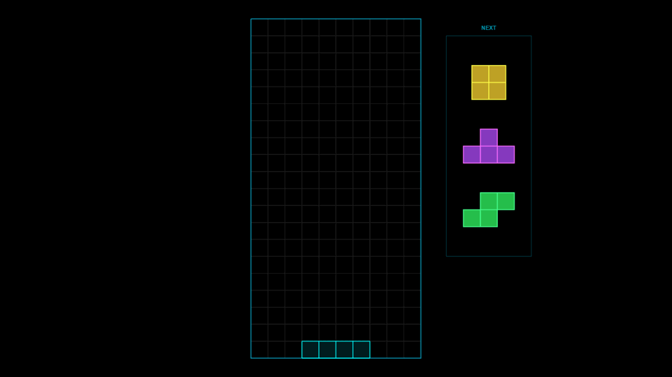</p>

### 5. Asteroids

Wireframe polygons with random vertices that split on impact - large asteroids become two medium, medium become two small, each faster than the last. Auto-fire crosshair tracks your cursor with swept segment collision. Wave-based with increasing asteroid count and speed.

<p align="center">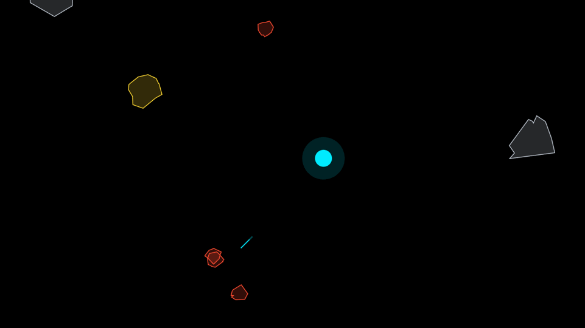</p>

### 6. Space Invaders

3 alien types across 5 hand-crafted wave formations - from a 2-row scout party to a 4-row onslaught of armored elites. Destructible shields absorb fire from both sides. Power-up drops (laser for double fire rate, shield dome, extra life) and escalating enemy fire rates.

<p align="center">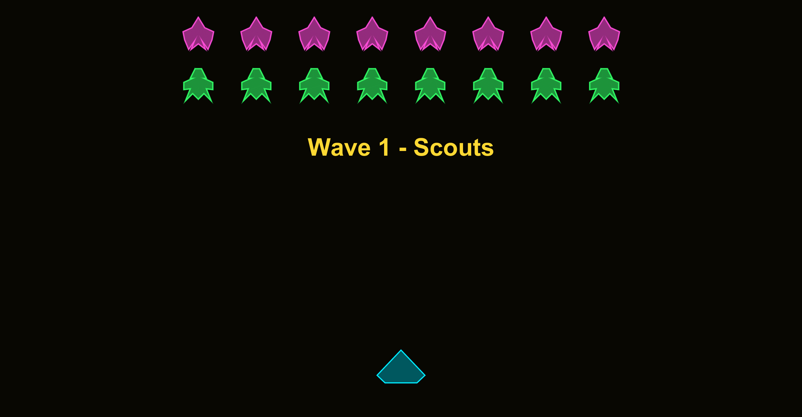</p>

### 7. Flappy Bird

Pipe gaps shrink as your combo grows, and scroll speed ramps with each pipe cleared. Space, Up, or click to flap.

<p align="center"></p>

### 8. Fruit Ninja

Slash fruit as they fly across the screen. Cut multiple fruits in quick succession for score multipliers - the slash line extends and turns golden on multi-cuts. Centrality scoring rewards cuts through the center.

<p align="center"></p>

---

## The Originals

7 original games - physics toys, speed challenges, and shooters designed to push your reflexes.

### 9. Target Practice

Glowing targets appear and shrink on a real-time countdown. Hit them before they vanish. Combo tightens both the timer and the target radius. Color shifts from cyan to red as time runs out.

<p align="center">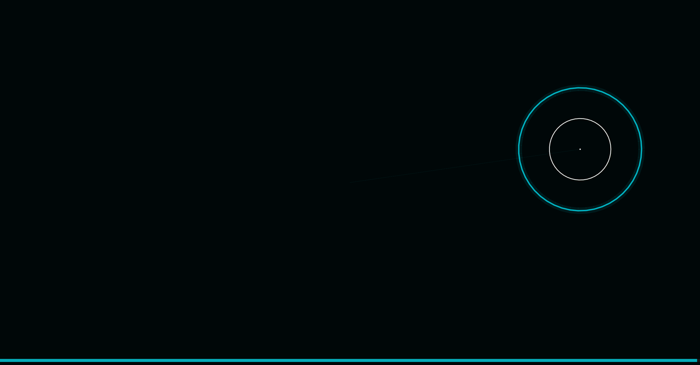</p>

### 10. Firefly Chase

5 tiers of fireflies on orbital paths - cyan, green, magenta, purple, and gold. The "Golden Snitch" firefly traces Lissajous curves and actively evades your cursor. Combo multiplier rewards rapid catches.

<p align="center">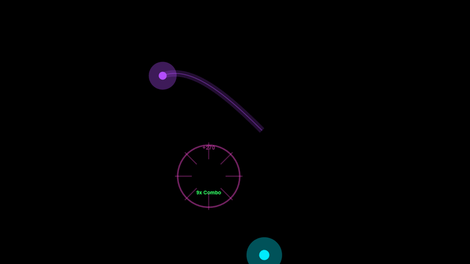</p>

### 11. Flick It!

Flick a physics orb off walls with your mouse. The ball shifts from cyan to red with speed. 3-layer neon rendering (aura, glow, core) with a comet trail that reflects off every surface. Re-flick a moving ball for combo.

<p align="center">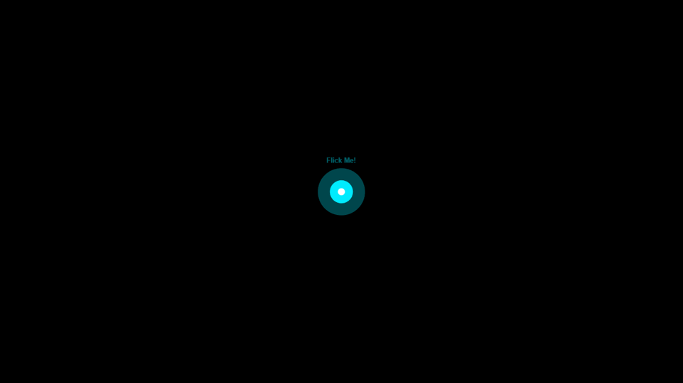</p>

### 12. Juggler

Keep balls airborne with juggle physics and gravity - no bottom wall, so a missed catch means a lost ball. Drop one and the combo resets. Extra balls spawn every 10 combo. All balls share identical 3-layer rendering and seamlessly promote when the leader is lost.

<p align="center">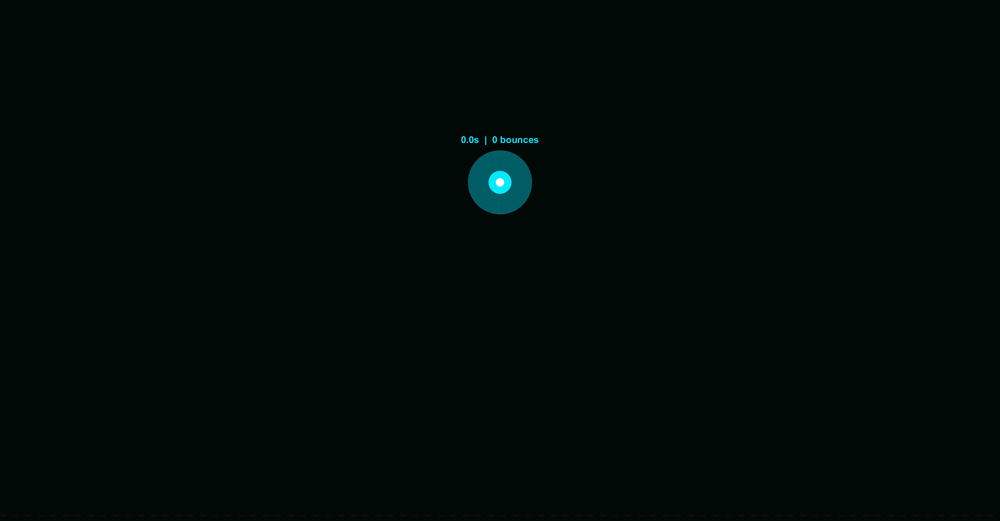</p>

### 13. Orbital Defense

Defend a hex base from asteroid waves across 3 tiers (large, medium, small). Launch interceptors with your cursor - detonations trigger chain-reaction explosions that cascade through overlapping blast radii. Asteroids split on destruction, and difficulty escalates each wave.

<p align="center">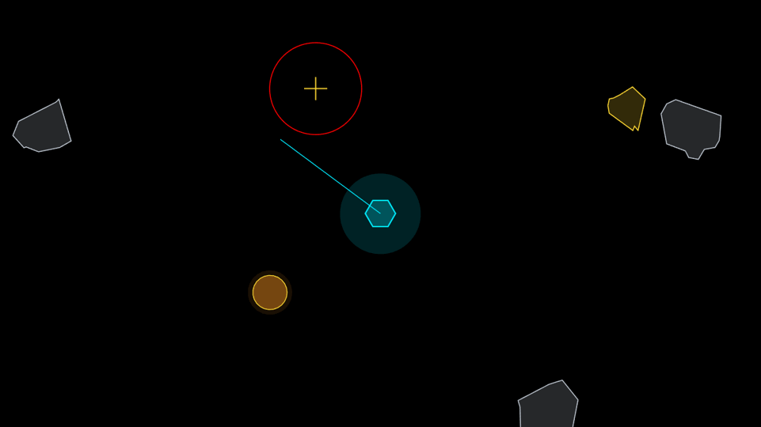</p>

### 14. Shield Guardian

Rotate a shield arc to deflect incoming projectiles and protect your core. 3 projectile types (fast, normal, heavy). Deflected projectiles can chain-hit other incoming shots. Waves escalate in speed and density.

<p align="center">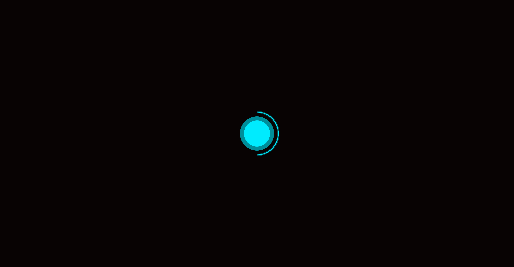</p>

### 15. Rail Shooter

Pseudo-3D on-rails shooter with depth-scaled perspective. 4 enemy types - fighters, cruisers, interceptors, and dreadnought bosses - approach from a vanishing point. Hand-crafted wave compositions through wave 5, then procedural generation. Breathing crosshair with auto-fire.

<p align="center">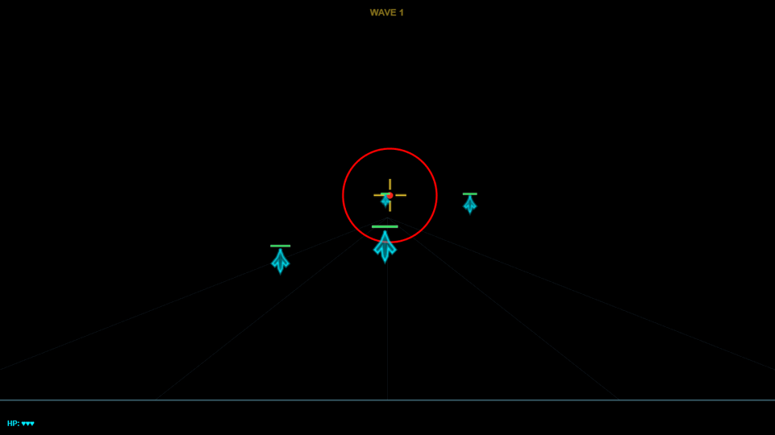</p>

---

## Controls

| Key | Action |
|-----|--------|
| Mouse / Arrow keys | Navigate menu or control cursor in-game |
| Click / Enter / Space | Select game (menu) or game-specific action |
| Scroll wheel | Scroll menu list |
| P | Pause / Resume |
| R | Restart current game |
| Esc | End round (in-game) or quit (menu) |

<details>
<summary>Game-specific controls</summary>

| Game | Controls |
|------|----------|
| **Snake** | Arrow keys for direction (or mouse-guided) |
| **Tetris** | Left/Right = move, Up/Z = rotate CW, X = rotate CCW, Down = soft drop, Space/Click = hard drop, Scroll = rotate |
| **Flappy Bird** | Space / Click = flap (standalone mode; cursor Y controls bird in launcher) |

</details>

---

## Features

| | |
|---|---|
| **Persistent High Scores** | Scores, combos, play counts, and session times saved across sessions |
| **Frame-Rate Independence** | Physics runs at consistent speed from 20 to 240+ FPS |
| **Auto-Scaling Display** | All text, markers, and line widths resize automatically on window resize |
| **Combo System** | Shared scoring with multipliers and animated fade-outs across all games |
| **Neon Visual Style** | 3-layer ball rendering (aura + glow + core), comet trails, particle bursts |
| **Standalone Mode** | Every game runs independently: `games.Pong().play();` |
| **HTML5 Port** | All 15 games in a single file - verified identical physics, scoring, and visuals across both platforms |
| **Subclassable** | Override `buildRegistry` and `getMenuTitles` for custom game sets |
| **Extensible** | Add your own games by subclassing `engine.GameBase` |

---

## High Scores

Scores persist in `data/scores.mat` (auto-created on first play, not tracked in git). Each record stores high score, max combo, total plays, and cumulative session time.

```matlab
services.ScoreManager.get("Pong")          % view a game's record
services.ScoreManager.getAll()             % view all records
services.ScoreManager.clearGame("Pong")    % reset one game
services.ScoreManager.clearAll()           % reset everything
```

---

## Requirements

- **MATLAB R2022b** or later
- No additional toolboxes

---

## Project Structure

```
Arcade.m                 entry point
+engine/
    GameBase.m           abstract base class for all games
+ui/
    GameMenu.m           animated menu with starfield and comets
+services/
    ScoreManager.m       persistent high-score storage
+games/                  15 game classes
index.html               HTML5 Canvas port (all 15 games, single file)
technical.html           technical documentation page
dev/
    README.md            architecture and technical details
    TODO.md              development roadmap
packaging/               toolbox, executable, and icon generation
assets/                  demo GIFs and screenshots
```

For architecture details, FPS scaling internals, and per-game technical breakdowns, see [dev/README.md](dev/README.md).

---

## Technical Highlights

<details>
<summary>Frame-rate-independent physics</summary>

All game physics scale by a per-frame `DtScale` factor:

```matlab
DtScale = rawDt * RefFPS    % exactly 1.0 when running at RefFPS (60)
```

| Pattern | Usage |
|---------|-------|
| Velocity | `pos = pos + vel * ds` |
| Gravity | `vel = vel + gravity * ds` |
| Friction | `vel = vel * friction ^ ds` |
| Random events | `rand < probability * ds` |

Ball trails use a DtScale accumulator that records every 2.0 units, ensuring consistent trail length from 30 to 240+ FPS. Bounce contact points are force-recorded to prevent gaps at wall/paddle/brick reflections.

</details>

<details>
<summary>Swept collision detection</summary>

Breakout uses a 2-pass swept collision algorithm:

1. **Pass 1**: Test the ball's path against every brick AABB (expanded by ball radius). Find the brick with the smallest parametric `tMin` - the earliest collision along the path.
2. **Pass 2**: Process only that brick - reflect velocity, apply damage, spawn effects.

This prevents the ball from hitting the wrong brick when multiple bricks overlap the path at high speed. Fireball mode recurses to destroy all bricks along the trajectory.

Pong uses parametric wall collision (`tHit = (wallY - preY) / stepVelY`) for exact contact points at any speed.

</details>

<details>
<summary>Multi-ball promotion</summary>

When Breakout's main ball exits play, the first extra ball is seamlessly promoted:

- Old main ball's graphics handles are deleted
- Extra ball's handles, trail buffer, and accumulator state are adopted directly
- The trail carries over without visual discontinuity
- The extra ball array is shortened; no handles are destroyed in the process

All balls render identically: same 3-layer glow stack, same speed-dependent trail width and alpha, same DtScale accumulator.

</details>

<details>
<summary>Graphics pool pattern</summary>

All 15 games pre-allocate every graphics object in `onInit`. No `line()`, `scatter()`, `patch()`, or `text()` calls occur during gameplay - objects are recycled via `Visible = "on"/"off"` and property updates.

MATLAB graphics creation costs 0.2-1ms per object (handle registration, renderer sync, memory). Property updates on existing handles cost under 0.01ms.

</details>

---

## Installation

### MATLAB Toolbox

Download [`Arcade.mltbx`](packaging/Arcade.mltbx) and install it via MATLAB's Add-On Manager. All packages are added to the path automatically. See the [packaging guide](packaging/) for build instructions.

### Standalone Executable (Windows)

No MATLAB license required. [`ArcadeInstaller.exe`](packaging/installer/ArcadeInstaller.exe) bundles a web installer that downloads the free [MATLAB Runtime R2025b](https://www.mathworks.com/products/compiler/matlab-runtime.html) automatically. See the [packaging guide](packaging/) for details.

### Browser

Open [`index.html`](index.html) in any modern browser - no installation, no server, no dependencies.

### From Source

Clone the repository and run `Arcade()` directly - no toolbox dependencies, works out of the box on MATLAB R2022b+.

<details>
<summary>Build distributable packages from source</summary>

```matlab
cd packaging
buildToolbox       % creates Arcade.mltbx
buildExecutable    % creates Arcade.exe + ArcadeInstaller.exe
generateIcon       % creates icon.png, splash.png
```

The toolbox requires MATLAB R2023a+ to build. The executable requires MATLAB Compiler. See [`packaging/`](packaging/) for full instructions.

</details>

---

## Development

This project was developed entirely through AI-assisted pair programming using [Claude](https://claude.ai) and the [MATLAB MCP Core Server](https://github.com/matlab/matlab-mcp-core-server). The MCP server enables Claude to inspect, analyze, and execute MATLAB code directly - from initial architecture through pixel-level visual matching between MATLAB and the HTML port.

---

## Author

**[Vasileios Bellos](https://www.mathworks.com/matlabcentral/profile/authors/13754969)**

## License

[MIT](LICENSE)
