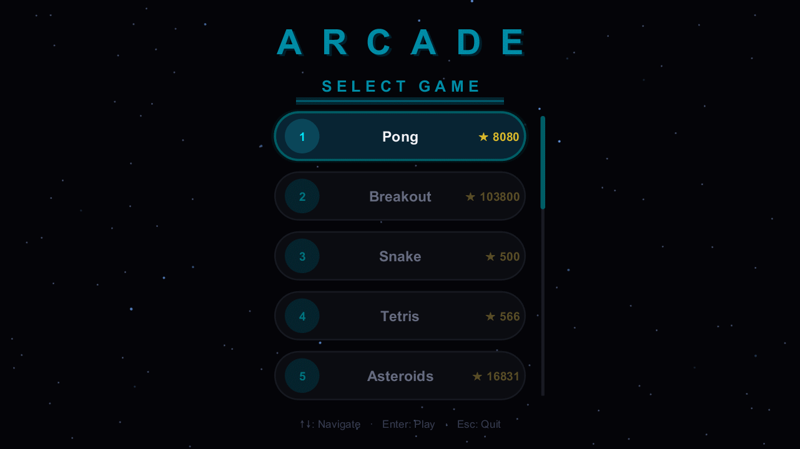

# MATLAB Arcade

15 arcade games built entirely in MATLAB — eight timeless classics and seven originals. No toolboxes, no external dependencies, no imported assets. Every pixel is drawn using native MATLAB graphics.

A neon-styled launcher with an animated starfield menu, persistent high scores, frame-rate-independent physics, and automatic display scaling ties everything together. Pick up and play with mouse, keyboard, or both.

Also available as a [browser port](web/arcade.html) — a single self-contained HTML5 Canvas file with all 15 games.

<p align="center">
  
</p>

> Built with [Claude](https://claude.ai) via the [MATLAB MCP Server](https://github.com/matlab/matlab-mcp-core-server) — AI-assisted development from architecture to pixel-level polish.

---

## Quick Start

```matlab
Arcade()
```

Or launch any game directly in standalone mode:

```matlab
games.Pong().play()
games.Tetris().play()
games.Asteroids().play()
```

---

## The Classics

Eight legendary arcade games, recreated from scratch in pure MATLAB.

### 1. Pong

AI opponent that adapts as you score. Paddle-angle physics with rally escalation and wall bounces. First to 10 wins.

<!-- <p align="center"></p> -->

### 2. Breakout

5 levels of bricks with power-ups (fireball, wide paddle, slow, multi-ball, extra life). Paddle angle controls the ricochet. Swept collision detection for precise brick hits at any speed.

<!-- <p align="center"></p> -->

### 3. Snake

Grid-based with wrap-around walls. Arrow keys or mouse-guided movement. Speed increases as you grow.

<!-- <p align="center"></p> -->

### 4. Tetris

Full SRS rotation with wall kicks, ghost piece, 3-piece preview, and instant hard drop. Level progression increases gravity.

<!-- <p align="center"></p> -->

### 5. Asteroids

Wireframe polygons that split on impact. Auto-fire crosshair tracks your cursor. Wave-based with increasing asteroid count and speed.

<!-- <p align="center"></p> -->

### 6. Space Invaders

3 alien types across 5 wave formations. Destructible shields, power-up drops (laser, shield), and escalating enemy fire rates.

<!-- <p align="center"></p> -->

### 7. Flappy Bird

Pipe gaps tighten and scroll speed ramps with combo. Space, Up, or click to flap. Gravity and flap impulse scale to display size.

<!-- <p align="center"></p> -->

### 8. Fruit Ninja

Slash fruit as they fly across the screen. Cut multiple fruits in quick succession for score multipliers — the slash line extends and turns golden on multi-cuts. Centrality scoring rewards cuts through the center.

<!-- <p align="center"></p> -->

---

## The Originals

Seven original games — physics toys, reflex challenges, and shooters designed to push MATLAB's real-time graphics.

### 9. Target Practice

Glowing targets appear and shrink on a real-time countdown. Hit them before they vanish. Combo tightens the timer. Color shifts from cyan to red as time runs out.

<!-- <p align="center"></p> -->

### 10. Firefly Chase

5 tiers of fireflies on orbital paths — cyan, green, magenta, purple, and gold. The "Golden Snitch" firefly traces Lissajous curves and actively evades your cursor. Combo multiplier rewards rapid catches.

<!-- <p align="center"></p> -->

### 11. Flick It!

Flick a physics orb off walls with your mouse. The ball shifts from cyan to red with speed. Three-layer neon rendering (aura, glow, core) with a comet trail that reflects off every surface. Re-flick a moving ball for combo.

<!-- <p align="center"></p> -->

### 12. Juggler

Keep balls airborne with flick physics and gravity. Drop one and the combo resets. Extra balls spawn at score milestones. All balls share identical rendering and seamlessly promote when the leader is lost.

<!-- <p align="center"></p> -->

### 13. Orbital Defense

Defend a hex base from asteroid waves. Launch interceptors with your cursor for chain-reaction explosions. Escalating difficulty with lives system.

<!-- <p align="center"></p> -->

### 14. Shield Guardian

Rotate a shield arc to deflect projectiles and protect your core. Swept quadratic collision prediction for accurate deflections. Waves escalate in speed and density.

<!-- <p align="center"></p> -->

### 15. Rail Shooter

Pseudo-3D on-rails shooter with depth-scaled perspective. 4 enemy types (grunt, heavy, interceptor, boss) approach from a vanishing point. Breathing crosshair with auto-fire DPS system.

<!-- <p align="center"></p> -->

---

## Controls

| Key | Action |
|-----|--------|
| Mouse / Arrow keys | Navigate menu or control cursor in-game |
| Click / Enter / Space | Select game (menu) or game-specific action |
| Scroll wheel | Scroll menu list |
| P | Pause / Resume |
| R | Restart current game |
| Esc | End round (in-game) or quit (menu) |

<details>
<summary>Game-specific controls</summary>

| Game | Controls |
|------|----------|
| **Snake** | Arrow keys for direction (or mouse-guided) |
| **Tetris** | Left/Right = move, Up/Z = rotate CW, X = rotate CCW, Down = soft drop, Space/Click = hard drop, Scroll = rotate |
| **Flappy Bird** | Space / Click = flap (standalone mode; cursor Y controls bird in launcher) |

</details>

---

## Features

| | |
|---|---|
| **Persistent High Scores** | Scores, combos, play counts, and session times saved across sessions |
| **Frame-Rate Independence** | `DtScale = rawDt * RefFPS` — physics runs at consistent speed from 20 to 240+ FPS |
| **Auto-Scaling Display** | `FontScale = min(axPx/854, axPx/480)` — all text, markers, and line widths resize on window resize |
| **Combo System** | Shared scoring with multipliers and animated fade-outs across all games |
| **Neon Visual Style** | Three-layer ball rendering (aura + glow + core), comet trails, particle bursts |
| **Standalone Mode** | Every game runs independently: `games.Pong().play()` |
| **HTML5 Port** | All 15 games in a single `arcade.html` — same physics, same visuals, any browser |
| **Subclassable** | Override `buildRegistry` and `getMenuTitles` for custom game sets |
| **Extensible** | Add your own games by subclassing `engine.GameBase` |

---

## High Scores

Scores persist in `data/scores.mat`, auto-created on first play.

```matlab
services.ScoreManager.get("Pong")          % view a game's record
services.ScoreManager.getAll()             % view all records
services.ScoreManager.clearGame("Pong")    % reset one game
services.ScoreManager.clearAll()           % reset everything
```

---

## Requirements

- **MATLAB R2022b** or later
- No additional toolboxes

---

## Project Structure

```
Arcade.m                 entry point
+engine/
    GameBase.m           abstract base class for all games
+ui/
    GameMenu.m           animated menu with starfield and comets
+services/
    ScoreManager.m       persistent high-score storage
+games/                  15 game classes
web/
    arcade.html          HTML5 Canvas port (all 15 games, single file)
docs/
    DEVELOPER.md         architecture and technical details
    TODO.md              development roadmap
recording/               GIF/video capture scripts
assets/                  demo GIFs and screenshots
```

For architecture details, FPS scaling internals, and per-game technical breakdowns, see [docs/DEVELOPER.md](docs/DEVELOPER.md).

---

## Development

This project was developed entirely through AI-assisted pair programming using [Claude](https://claude.ai) and the [MATLAB MCP Server](https://github.com/matlab/matlab-mcp-core-server). The MCP server enables Claude to inspect, analyze, and execute MATLAB code directly — from initial architecture through pixel-level visual matching between MATLAB and the HTML port.

---

## License

MIT
